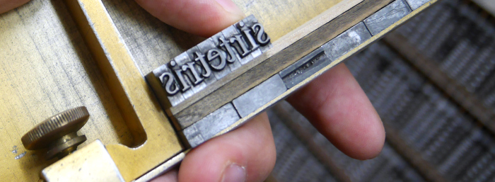

# Context
*The world is full of interesting things to be discovered, learned, practiced. As one searches for new input, seeing what others are doing can be a source of inspiration, and advice from someone already into a specific thing can be of great help. Therefore I'd like to share what keeps me moving, learning, living and offer hints and resources for the potentially interested.*

Apart from what’s shown here, be sure to also check out [the webring](https://webring.xxiivv.com/) linked at the bottom of the page.

<!-- sep -->

# Letters
A 𝖆 𝒜 𝚊 α あ ア 安 ㌁ 알 א ∀ 🄰 ㎂ ㏂ ℀ 🂡 🍙

Writing systems are fascinating, typography is aesthetic, and letterpress printing is just cool in a steampunk-y, craftsman-y way. If you’re also into things like that, find some goodies down below.

### Languages

Japanese is written in a mix of three character sets; two syllabaries *and* a set of logographic characters. Example: the word for eraser, 消しゴム, starts with the logograph 消 meaning “to erase“, continues with the hiragana letter し (for grammar reasons) representing the sound “shi”, and ends with the katakana letters ゴム representing the sounds “go“ and “mu“ (“gomu” ≈ “gum”) respectively. Depending on stylistic choice, it is also possible to switch between the three sets of symbols. For example, the [Japanese Wikipedia article on seals](https://ja.wikipedia.org/wiki/%E5%8D%B0%E7%AB%A0) contains the word pronounced “hanko” as “はんこ” in hiragana, “ハンコ” in katakana, and “判子” in kanji.

In Korean, letters are constructed from consonant and vowel components. For example, the letter 독, pronounced “tog”, consists of ㄷ, ㅗ, and ㄱ. So you type those three one after the other, and they turn into 독. When it comes to pronunciation though, the consonants at the end of letters can “move syllable”. The Korean word for Germany, 독일 (“togil”), for example, is not “tog” and “il” (letter by letter), but rather “to” and “gil”. A German person, 독일인, then is “to”, “gi”, and “lin”.

### Letters and Technology

Fun things happen when the madness of human driven writing systems is reflected in rigid structures of technological standards, like Unicode.

* [Unicode contains “ghost characters“](https://en.wikipedia.org/wiki/Ghost_characters)
* The Unicode block [CJK Compatibility](https://graphemica.com/blocks/cjk-compatibility) contains units of measurements and other terms in single characters in Japanese. For example, ㍌ reads “mega” in the upper line and “ton” below. (Here are some cryptic shenanigans with these [“kumimoji”](https://github.com/IllDepence/goyoukumimoji).)
* [Punycode](https://en.wikipedia.org/wiki/Punycode) is a fun character encoding used e.g. in non-Latin alphabet domain names.

### Books

* [Writing Systems of the World](https://www.goodreads.com/book/show/534188.Writing_Systems_of_the_World) (Japanese original: [世界の文字](https://shokado.nacos.com/books/?p=454))  
  A nice overview of the types of writing systems allover the world, with explanations and example images of e.g. newspapers.
* [Because Internet](https://gretchenmcculloch.com/book/)  
  On how real time written communication is a novel phenomenon enabled by the internet.
* [ユニコード戦記](https://www.tdupress.jp/book/b350011.html)  
  Telling about the struggles of representing Japan in the negotiations and consortia deciding on the Unicode standard.
* [活版印刷三日月堂（1](https://www.poplar.co.jp/book/search/result/archive/8101304.html)、[2](https://www.poplar.co.jp/book/search/result/archive/8101316.html)、[3](https://www.poplar.co.jp/book/search/result/archive/8101343.html)、[4](https://www.poplar.co.jp/book/search/result/archive/8101361.html)、[5](https://www.poplar.co.jp/book/search/result/archive/8101391.html)、[6）](https://www.poplar.co.jp/book/search/result/archive/8101394.html)  
  A series of novels centered around a small letterpress printing shop in modern day Kawagoe, Japan.

### Places

* [印刷博物館](https://www.printing-museum.org/)  
  The Tokyo Printing Museum — great exhibition and regular letterpress printing “mini workshops” (which is where the banner image above was taken).
* [漢字博物館・図書館](https://www.kyoto-museums.jp/museum/east/414/)  
  The Kanji museum in Kyoto. Aesthetically really nice exhibition and you can take mini mock-exams of the [Kanji Kentei](https://en.wikipedia.org/wiki/Kanji_Kentei).

### Misc

* [Uppestcase and Lowestcase Letters [advances in derp learning]](https://www.youtube.com/watch?v=HLRdruqQfRk) (YouTube)
* [graphemica](https://graphemica.com/) - an awesome website to look up information on characters

<!-- sep -->

# Tabletop Games
*Rectify. ... Rectify. ... Games!*

I grew up with Settlers of Catan, and in my twenties found Carcassonne as a second “all-time favorite”. I also *really* like “Stadt, Land, Fluss”, the German equivalent of the word game [categories](https://en.wikipedia.org/wiki/Categories_%28word_game%29). Below are some pointers and personal projects regarding games.

* **Catan**
    * [The fair Catan board quest](https://www.boardgameanalysis.com/the-fair-catan-board-quest/)  
      An interesting series of blog posts about fair Catan boards.
* **Carcassonne**
    * [Carcass∞nne](https://github.com/IllDepence/carcassoonne)  
      A minimalistic web interface to play Carcassonne with infinite tiles.
    * [Citétris de Carcassonne](https://github.com/IllDepence/citetris-de-carcassonne)  
      A work in progress implementation of Tetris with Carcassonne tiles.
* **Stadt, Land, Fluss**
    * [Stadt, Land, Fluss Kategoriekarten](https://github.com/IllDepence/slf_category_cards)  
      Card designs for choosing categories in a game of Stadt, Land, Fluss (the German equivalent of the word game [categories](https://en.wikipedia.org/wiki/Categories_%28word_game%29)).
    * [Stadt, Land, Fluss Web](https://github.com/IllDepence/slf_web)  
      A work in progress web implementation of Stadt, Land, Fluss where extra points are given based on the order of player answers per category.

‌  
Below some more general points.

* Events I like
    * [Schwarzwälder Spieletage](https://mounty.de/) (Furtwangen, Germany)
    * [ゲームマーケット](https://www.gamemarket.jp/) (Tokyo, Japan)
* Some Japanese games I own
    * [カタカナーシ](https://www.gentosha-edu.co.jp/smp/book/b450309.html)
    * [今日も帰れない](https://gamemarket.jp/game/21939)
    * [Ostle](https://gamemarket.jp/game/76310)
    * [ラブレター](https://www.gentosha-edu.co.jp/book/b378023.html) (Japanese version of Love Letter)
    * [フォントかるた](https://www.fontkaruta.com/)
    * [漢字博士No.1［特製］](https://ba2u2.com/kanji/01.html)
    * [漢字博士No.2](https://ba2u2.com/kanji/03.html)
    * [任天堂謹製 小倉百人一首 都錦](https://www.nintendo.co.jp/others/hyakuninisshu/index.html)
    * [下の句歌留多協会](http://www.shimonokukaruta.com/) from [ワダガング](http://www.wadagangu.co.jp/)

<!-- sep -->

# Knowledge curation
*wikiwiki*

I maintain a personal wiki in the form of interlinked Markdown files, synced between desktop and mobile via Git. Currently [Obsidian](https://obsidian.md/) serves as the editor/viewer. Previously I used [gitit](https://github.com/jgm/gitit) (desktop only).

At work, I have experienced two quite dissimilar wiki cultures.
* [Semantic MediaWiki](https://www.semantic-mediawiki.org) (2019 — 2024)
    * High upfront cost (for defining and implementing a data model)
    * Some degree of [inference](https://www.semantic-mediawiki.org/wiki/Help:Inferencing) of implicit knowledge
    * Open source
    * My experience
        * worked well to organize a research group
        * editing and reading happen at different times / you “store” knowledge that is “retrieved” at some later point in time
        * [page forms syntax](https://www.mediawiki.org/wiki/Extension:Page_Forms/Defining_forms) gave me headaches
* [Cosense](https://scrapbox.io/product) (2024 — now)
    * Superb for real time collaboration
    * Somewhat challenging to keep information up to date/synced across a wiki
    * Closed source; requires Google account
    * My experience
        * works great as the knowledge base of a remote-first organization
        * feels like everyone’s notepads amagamate into a living system
        * fun to use

Meat sack storage: use [Anki](http://ankisrs.net/) to prevent data loss.

<!-- sep -->

# Parkour
*“Recontextualizing public urban space as a playground instead of something merely functional.”* ([Source](https://soundcloud.com/officialsxsw/hacking-language-bots-if-and-esolangs-sxsw-interactive-2016))

Just look for people in your area doing parkour. In [my experience](/a/5fd38d56) such groups are extremely supportive towards newcomers. If you can't find anyone to train with, start on your own — you might [find followers](assets/img/interests/parkour2.jpg) soon. :D

To get an idea of what parkour is, watch [People in Motion](https://www.youtube.com/watch?v=QH09YCtpKaw). tl;dw: it's playing with one's environment by moving around.

Shameless brag: I used to do [double kongs](assets/img/interests/parkour.gif).

<!-- sep -->

# Slacklining
*&#124;—————————&#124;*

<!--
# Karuta
*難波津に…*

[Karuta](http://en.wikipedia.org/wiki/Karuta) is a Japanese loanword originally from Portuguese (“carta”) and a term used to describe several types of Japanese card games. A particularly interesting group of aforementioned is called uta-garuta and often based on the poem collection [Ogura Hyakunin Isshu](https://en.wikipedia.org/wiki/Ogura_Hyakunin_Isshu) by [Fujiwara no Teika](http://en.wikipedia.org/wiki/Fujiwara_no_Teika). [Kyōgi karuta](http://en.wikipedia.org/wiki/Competitive_karuta) is the competitive version of uta-garuta.

If you want to get an overview of karuta-type games and more detailed information feel free to have a look at [this info page](http://moc.sirtetris.com/karuta/) I created. A brief peak into kyōgi karuta right here:

An English version of the rules of kyōgi karuta can be found [here](http://karuta.game.coocan.jp/simplerule-e.html). Further useful resources:

* [Japan Karuta Association](http://www.karuta.or.jp/) (up-to-date information about tournaments)
* [World of Kyogi Karuta](http://karuta.game.coocan.jp/index.html)
* [Hyakunin Isshu overview with english translations](http://etext.virginia.edu/japanese/hyakunin/index.html)

To get an idea of how kyōgi karuta looks like:  
[Highlights from the 2014 championship final](https://www.youtube.com/watch?v=HUbXBcD2m6E)

Even more goodies:

* [the flickr account](https://secure.flickr.com/photos/nzkka/) of the New Zealand Karuta Association
* [a nice essay](http://www.asahi-net.or.jp/~xs3d-bull/essays/karuta/karuta.html) about kyōgi karuta
* on the off chance you’re interested in 下の句かるた, try checking out [BOOK OFF](https://www.bookoff.co.jp/) and [HARD OFF](https://www.hardoff.co.jp/) stores in Hokkaidō. In 2023 I got found [nice set](assets/img/interests/simonokukaruta.jpg) with wooden “cards” in Sapporo that way.

‌  
A fun way to learn more about the world of karuta would be reading the manga [Chihayafuru](http://en.wikipedia.org/wiki/Chihayafuru) or watching the anime adaptaion.
-->

<!-- sep -->

# Penspinning
*Contact juggling with pens!*

Giving penspinning a try couldn't be easier. Grab a more or less balanced pen, look at a video tutorial online and practice &mdash; that's it.  
It is, of course, more fun when you also get involved with the community. The largest international board on the topic of penspinning ~~is the [UPSB](http://upsb.info/), I guess~~ that I know of appears to have gone inactive. Most countries also have their own board/community. Try to look out for gatherings. It's most fun when you meet other spinners in person and talk to them. :)

Here's some viewing material: [Supawit](https://www.youtube.com/watch?v=Ug_D_jyOOmE), [pyralux](https://www.youtube.com/watch?v=2EGFq-jvhFc), [A13x](https://www.youtube.com/watch?v=5jaRrtGVc3A)

I, personally, started penspinning in 2007 and actively pursued it — i.e. took my time to practice, look out for new tricks to learn, etc. — for maybe a year and a half. After that it's been casual ever since. I barely try or practice new stuff ... but it's still a lot of fun and I don't plan to stop. :)

#### Some of my recordings

* [BakFall Session 3](https://www.youtube.com/watch?v=DHDyYK-nPIA)
* [Copy clip](https://www.youtube.com/watch?v=shhumscxa0s)
* [Freestyle](https://www.youtube.com/watch?v=mGnMcw7IM9I)

<!-- sep -->

# Keyboards
*High quality input devices. :3*

In terms of mechnaical keyboards, I used to use a SteelSeries 7G (MX Black) &rarr; a Leopold FC500RT/AB (MX Brown) &rarr; a KBC Poker (MX Blue) &rarr; a Vortex CORE (MX Blue, depicted above).

Over the years though, ThinkPads made me a sucker for trackpoints, which is why I currently use a ThinkPad TrackPoint Keyboard II as my daily driver, and occasionaly switch to a HHKB Studio.

Random tidbits:
* [Thumb-shift keyboards](https://en.wikipedia.org/wiki/Thumb-shift_keyboard) are an interesting concept
* Status LEDs of a keyboard are controlled by the computer ([docs.qmk.fm](https://docs.qmk.fm/features/led_indicators#host-keyboard-led-state), [wiki.osdev.org](https://wiki.osdev.org/USB_Human_Interface_Devices#LED_lamps)), meaning they can be [used as a side channel](https://github.com/DarkMetalMouse/ardiuno-keystroke-reflection) to exfiltrate information
* The literature sources for the German Wikipedia article [Flick-Input](https://de.wikipedia.org/wiki/Flick-Input) once sent me on a [quest to one of the world’s largest libraries](/a/2cea3972#:~:text=I%20decided%20to%20write%20a%20German%20Wikipedia%20article)

<!-- sep -->

# Japanese
*orz*

Prepare to face three different, partly redundant, simultaneously used scripts; characters made up of more than 20 strokes — whose order you have to get right btw. — with various ways to read and interpret them depending on their current context; and over 30 common, individual ways to count things, each associated with a group of things it's used for.

On the other hand pronunciation is super consistent (looking at you, English), grammar is totally manageable and there are awesome things like the word for “influence”, 「影響」, being written with the characters for “shadow” and “resonance”; or “strategy”, 「戦略」, with “battle” and “shortcut”. Also, the word for “crowd of people”, 「人混み」, has the same pronunciation as “people garbage”.

Appetizer: NativLang's [three](https://www.youtube.com/watch?v=bcdYKxHT8kY) [part](https://www.youtube.com/watch?v=CF3MRMBjd20) [series](https://www.youtube.com/watch?v=TD7Lc4QBh5w) on writing Japanese  
“It's the most bizarrely complicated writing system within a system ever devised by humankind.” 

#### Overview

* [/r/LearnJapanese](http://www.reddit.com/r/LearnJapanese/)'s [wiki](http://www.reddit.com/r/LearnJapanese/wiki/index)
* [Tofugu’s 100 Best Resources For Learning Japanese](http://www.tofugu.com/2010/04/06/tofugu-100-best-japanese-learning-resources/)
* [Japanese FAQ](http://www.sljfaq.org/afaq/afaq.html) (from the usenet newsgroup sci.lang.japan)
* [all japanese all the time TOC](http://web.archive.org/web/20220910084810/http://www.alljapaneseallthetime.com/blog/all-japanese-all-the-time-ajatt-how-to-learn-japanese-on-your-own-having-fun-and-to-fluency/)
* [Japanese pitch accent resources](https://github.com/olety/japanese-pitch-accent-resources)

#### Guides

* [Tae Kim's Guide to Learning Japanese](http://www.guidetojapanese.org/learn/) (free, with extensive grammar guide)
* [IMABI](http://www.imabi.net/) (free, 200+ lessons from beginner over itermediate and advanced up to classical Japanese)
* [An Introduction to Japanese; Syntax, Grammar & Language](http://grammar.nihongoresources.com/) (free, extensive grammar guide)
* [TextFugu](http://www.textfugu.com/) (free *only* up to the point where you'd start learning kanji)
* [Japanese Pronunciation for Communication (Waseda University)](https://www.edx.org/course/japanese-pronunciation-for-communication) (free, pronunciation guide)
* [Pronunciation: Speaking with Fluency (Waseda University)](http://web.archive.org/web/20201201000944/http://course-channel.waseda.jp/subject/contents/9204B34014/01/92) (free, pronunciation guide)
<!-- * [Tofugu's writings on learning](http://www.tofugu.com/tag/learning/) -->

#### Use

* [Lang-8](http://lang-8.com/) (corrections from native speakers)
* [Anki](http://ankisrs.net/) ([SRS](https://en.wikipedia.org/wiki/Spaced_repetition) with synchronization)
    * [Japanese Support](https://ankiweb.net/shared/info/3918629684) (plugin)
    * [Automatically add pitch accent information to cards](https://ankiweb.net/shared/info/148002038) (plugin)
    * [Script for plotting the number of kanji in an Anki deck over time](https://github.com/IllDepence/kanjiplot)
    * [Script for finding new useful vocab based on frequency lists](https://github.com/IllDepence/findvocab)
* Dictionaries:
    * PC: [qolibri](https://github.com/ludios/qolibri/)+[EPWINGs](/a/bbcb7e53) / [Tagaini Jisho](http://www.tagaini.net/)
    * Web: [goo辞書](https://dictionary.goo.ne.jp/), [WWWJDIC](http://nihongo.monash.edu/cgi-bin/wwwjdic), [Denshi Jisho](http://jisho.org/)
    * Browser plugin for [Firefox](http://rikaichan.mozdev.org/) and [Chrome](https://chrome.google.com/webstore/detail/rikaikun/jipdnfibhldikgcjhfnomkfpcebammhp)
    * Android: [monolingual & offline](/a/bbcb7e53)
    * Android/iOS: [Outlier Kanji Dictionary](https://www.outlier-linguistics.com/products/outlier-kanji-dictionary-essentials-edition)
* Examples sentences and collocations:
    * [Tsukuba Web Corpus](http://nlt.tsukuba.lagoinst.info/)
    * [Balanced Corpus of Contemporary Written Japanese](http://nlb.ninjal.ac.jp/)
    * [YouGlish](https://youglish.com/japanese)
* [漢字倶楽部](https://kanji.club/) (Kanji lookup by components)
* [Online Japanese Accent Dictionary](http://www.gavo.t.u-tokyo.ac.jp/ojad/)
* [News in Slow Japanese](http://newsinslowjapanese.com/home/) (listening practice)
* [KanjiTomo](http://www.kanjitomo.net/) (identify Japanese characters from images)
* [JLPT kanji check](http://moc.sirtetris.com/jlptkanjicheck/)
* [minimum font size for Japanese text](http://moc.sirtetris.com/enlargeJapanese.user.js) (user script)
* [GNU Unifont](http://unifoundry.com/unifont.html) (useful for graphemes/radicals)
<!--* Wallpaper for [dates](assets/img/interests/dates_anime.png), [time](assets/img/interests/time_anime.png), [timespans](assets/img/interests/timespans_anime.png), [casual grammar](assets/img/interests/casuals_anime.png), [indefinite pronouns](assets/img/interests/indefinite_pronouns_anime.png)  -->
* [Kana input without IM](/a/079cf21f) (Linux/BSD)

#### Absorb

* About Japan (this is a [dark playground](https://waitbutwhy.com/2013/10/why-procrastinators-procrastinate.html#note-1-502), try to get to a point where content *in* Japanese is fun)
    * [Tofugu](https://www.youtube.com/user/tofugu)
    * [Rachel & Jun](https://www.youtube.com/@RachelandJunAdventures) <!--https://www.youtube.com/user/MyHusbandisJapanese)-->
    * [Hikosaemon](https://www.youtube.com/user/Hikosaemon)
<!--    * [BusanKevin](https://www.youtube.com/user/BusanKevin) / [jlandkev](https://www.youtube.com/user/jlandkev) -->
<!--    * [Gimmeabreakman](https://www.youtube.com/gimmeabreakman) / [Gimmeaflakeman](https://www.youtube.com/user/Gimmeaflakeman) -->
<!--    * [ミカエラ](https://www.youtube.com/user/Ciaela) / [Micaela Braithwaite](https://www.youtube.com/user/mikaeradesu) -->
* In Japanese
    * [Dogen](https://www.youtube.com/user/Dogen)
    * [rebuild.fm](https://rebuild.fm/)
    * [ゆる言語学ラジオ](https://radio.ken-horimoto.com/) / [YT](https://www.youtube.com/channel/UCmpkIzF3xFzhPez7gXOyhVg)
    * [researchat.fm](https://researchat.fm/)
    * [backspace.fm](http://backspace.fm/)
<!--    * [学生のイドバタ会](https://radiopublic.com/-8Xow2k) -->
    * [GINプロジェクト](https://www.youtube.com/channel/UCQ1LG3Z-Ot6MdxooyzQRYBA)
    * [国立国語研究所](https://twitter.com/kokugoken)
    * [文学YouTuberベル](https://www.youtube.com/channel/UCL4QAojeGy6CJ9R2PwmlmJQ)
    * [コウイチTV](https://www.youtube.com/user/kouichitv)
    * [さーちゃんネル](https://www.youtube.com/channel/UCcDZtKh3a7EiscYgbr_468w)
<!--    * [ご当地ざっくり10秒インタビュー](https://www.youtube.com/user/gotouchi10sec) -->
    * [無駄づくり MUDAZUKURI -Wasted Creation-](https://www.youtube.com/user/mudadukuri)
    * [木下ゆうか Yuka Kinoshita](https://www.youtube.com/user/kinoyuu0204)
<!--    * [ARI OR ALI](https://www.youtube.com/user/ARIORALI) / [Ari Keita](https://www.youtube.com/user/ARIKEITA113) -->
    * [nihongonomori joey](https://www.youtube.com/user/freejapaneselessons3)
    * [Google Japan](https://www.youtube.com/user/googlejapan)
    * [@hideki\_1231](https://www.tiktok.com/@hideki_1231)
    * [@naokorisu](https://www.tiktok.com/@naokorisu)
    * [@burrihi\_gty\_ik](https://www.tiktok.com/@burrihi_gty_ik)
    * [@takeshibengo](https://www.tiktok.com/@takeshibengo)
<!--    * [Japanese-Subtitles](http://jpsubbers.web44.net/Japanese-Subtitles/) -->

### Interact

* Online
    * [HelloTalk](https://www.hellotalk.com/)
    * [Tandem](https://tandem.net/)
    * [Quora](https://jp.quora.com/)
<!--    * [Yahoo!知恵袋](http://chiebukuro.yahoo.co.jp/dir/dir_list.php) Yahoo! GDPR nope’d -->
* Offline
    * [Meetup](https://www.meetup.com/) (try to find meetups where description/details/etc. are only given in Japanese)
    * [connpass](https://connpass.com/) (aimed at engineers)
    * [Peatix](https://peatix.com/)
    * [TwiPla](https://twipla.jp/)

‌  
My personal Japanese progress has it's own place in the [projects section](/projects).

<!-- sep -->

# (Urban) Exploration
*Because it's there.*

To get an idea of what it is about, watch [Crack The Surface - Episode I](http://vimeo.com/26200018) and [Episode II](http://vimeo.com/35626914).  
In short, it is the exploration of man-made stuff. Objects of interest vary as much as reasons to do it I guess. For me, personally, it's about adventure, appreciation and to some extend photography. Sadly though, I only *very* rarely got around to do it so far.  

<strong>2008 &gt; trains</strong>

<strong>2011 &gt; more trains</strong>

<strong>2012 &gt; gravel plant</strong>

<!-- sep -->

# Lock picking
*Locks are meant to keep honest people honest.*

For a written intro into lock picking take a look at the [MIT Guide to Lock Picking](http://lockpickguide.com/support-files/mitguidetolockpick.pdf). If you prefer video, a great starting point is Schuyler Towne's video series [Locks: Basic operation and manipulation](http://www.youtube.com/playlist?list=PL66CD42F86F3A1F85).  
Further places to look for interesting content include [TOOOL](http://toool.us/) (The Open Organisation Of Lockpickers), [/r/lockpicking](http://www.reddit.com/r/lockpicking/) and the [DEF CON Media Archives Portal](https://www.defcon.org/html/links/dc-archives.html), where you can find a lot of recorded talks on the subject of lock picking and physical security in general.

<!-- sep -->

# Speedrunning
*Playing through games quickly, skillfully, and legitimately.*

As far as I can tell the places to go to for speedrunning content are the [Speed Demos Archive](http://speeddemosarchive.com/) and [Speed&shy;Runs&shy;Live](http://www.speedrunslive.com/). If you want to get a general idea of what a speedrun is and what a speedrunner does, take a look at [Portal Done Pro](https://www.youtube.com/watch?v=W1U5RUVENNE) *and* the [Portal Done Pro - Commentary Video](https://www.youtube.com/playlist?list=PL359B764A0A3B8188). Note that this run does not comply with the rules of SDA and is not listed there. Nonetheless does it give a nice glimpse into the world of speedrunning. A very entertaining way to learn a bit more can be following one of SDA's [marathons](http://marathon.speeddemosarchive.com/), where a group of speedrunners plays through a ton of games throughout several days. Most of them comment on what they are doing while playing, so you get an insight into what the key techniques are for running a particular game.

Apart from speedruns gathered at SDA, there are also runs called TAS — tool-assisted speedruns. I don't know a lot about them, but I guess [TASVideos](http://tasvideos.org/) is a good resource to start with.

I myself never did serious speedrunning. Casual (and old) stuff:

* [Portal Testchamber 14 done in 4 seconds](https://www.youtube.com/watch?v=ocARZ9qdx_I)
* [Half Life Hazard Course done in 3:23](https://www.youtube.com/watch?v=2gG5PCDWQJ4)

<!-- sep -->

# Remix culture
*“Copyright is brain damage.“* ([Source](https://www.youtube.com/watch?v=XO9FKQAxWZc))

Maybe not a hobby in the traditional sense, but something I would like people to be more aware of and where I try to lead by example. Use (and thereby spread) stuff that is permissively licensed ([e.g. muisc](https://www.youtube.com/watch?v=URz6XdYJdqw)), buy [DRM free](https://www.defectivebydesign.org/guide) whenever possible, release under permissive licenses yourself.

If you haven't seen it yet, watch [Everything is a Remix](https://vimeo.com/139094998). Further down some very specific realms of remix culture.

### Doujinshi
Not only what brought the concept of [drifting trains](http://m-ex.jp/circle/catalog/D01/d01.htm) into this world, but also a nice example especially worth highlighting to western audiences of a healthy, living remix culture that is not being held back by ignorant backfiring corporate efforts.

“Doujinshi is [...] like celebration, an ongoing fan party. [...] in America, grumpy rights holding companies shut down the party by calling the cops. In Japan, companies let the music play because they realize the party's in their honor.” — [Tofugu](https://www.tofugu.com/japan/doujinshi-definition/)

Also: [Copyright and Comics in Japan: Does Law Explain Why All the Cartoons My Kid Watches are Japanese Imports?](https://papers.ssrn.com/sol3/papers.cfm?abstract_id=347620)

### AMVs
No connection to licensing and legality here. Just fun content if it's your cup of tea. Quality AMV sources: [amvnews.ru](http://amvnews.ru/) and the [Recommended AMVs](http://www.animemusicvideos.org/forum/viewforum.php?f=41) subforum on animemusicvideos.org.

Example AMVs:

<!-- div for mobile device special treatment, markdown="1" attribute is Kramdown specific: https://kramdown.gettalong.org/syntax.html#html-blocks -->

Creator | Title | Source | Download | YouTube
:-|:-|:-|:-:|:-:
Hagaren Viper | This Is Halloween | Soul Eater | [💾](http://www.animemusicvideos.org/members/members_videoinfo.php?v=172517) | [▶](https://www.youtube.com/watch?v=i_zYrYkbrGY)
Gorz | Beauty And A Glitch | Fate/stay night: UBW | [💾](http://amvnews.ru/index.php?go=Files&in=view&id=6610) | [▶](https://www.youtube.com/watch?v=w7U3oQbnVP4)<!--[▶](https://www.youtube.com/watch?v=0pRJJhAjosc)-->
Shin | Nefarium Psychologica | Mahou Shoujo Madoka Magica | [💾](http://www.akross.ru/index.cgi?act=video;id=4405) | [▶](https://www.youtube.com/watch?v=EJ-dnuFItAE)
Shin | Mahou Shoujo Requiem | Mahou Shoujo Madoka Magica | [💾](http://amvnews.ru/index.php?go=Files&in=view&id=3445) | [▶](https://www.youtube.com/watch?v=4Q9wGu3ILeo)
Kisanzi | The Nightmagi Cometh | Mahou Shoujo Madoka Magica | [💾](http://amvnews.ru/index.php?go=Files&in=view&id=4955) | [▶](https://www.youtube.com/watch?v=JiKxNI7_5dc)
RenaSun | Externalize | Chihayafuru/mixed | [💾](http://amvnews.ru/index.php?go=Files&in=view&id=5072) | [▶](https://www.youtube.com/watch?v=09cyrQu5yVA)
lokkiclu | Title Goes Here | Bakemonogatari | [💾](http://amvnews.ru/index.php?go=Files&in=view&id=4902) | [▶](https://www.youtube.com/watch?v=RtjtNrnj4HM)
Okami | Futuristic Lover | Bakemonogatari | [💾](http://amvnews.ru/index.php?go=Files&in=view&id=3281) | [▶](https://www.youtube.com/watch?v=iPoH19FuUJQ)
Nostromo | Binary Overdrive | Genius Party Beyond | [💾](http://www.nostro.fr/amv-binary-overdrive/) | [▶](https://www.youtube.com/watch?v=QwMSemZX81U)
Nostromo | Distant Echo | mixed | [💾](http://www.nostro.fr/amv-distance-mep/) | [▶](https://www.youtube.com/watch?v=nVMPiEilNm4)
EvilSpiritAMV | Visible | mixed | [💾](http://amvnews.ru/index.php?go=Files&in=view&id=5430) | [▶](https://www.youtube.com/watch?v=ZdQzpWOqBX8)
Padre | Whack | One Punch Man | [💾](http://amvnews.ru/index.php?go=Files&in=view&id=7590) | [▶](https://www.youtube.com/watch?v=Z1p5Y494TV8)
007 Vegita | Race Against Time Trailer | Dragonball Z | [💾](http://www.video-game-chat.com/dbzsc/) | [▶](https://www.youtube.com/watch?v=sgeXlq1jvVY)
seriy | Affective Schoolgirls | Nichijou | [💾](http://amvnews.ru/index.php?go=Files&in=view&id=4569) | [▶](https://www.youtube.com/watch?v=2uHRi67mlsc)
Umika, ZEVS1993 | Our Tapes | mixed | [💾](http://amvnews.ru/index.php?go=Files&in=view&id=4470) | [▶](https://www.youtube.com/watch?v=Z6IL_YVNBDQ)

‌

<!-- sep -->

# MOAR
Stuff that I was into, want to get into, am into but lack usable content to present or motivation to create a section for, is represented somewhere else on the site, etc.

* linux
* free and open-source
* it security
* sharing economy, collaborative consumption, crowdsourcing
* i18n/l10n
* speedcubung ([WCA](https://www.worldcubeassociation.org/persons/2013SAIE02))
* geocaching
* physical security (see [lock picking](#lockpicking))
* psychology (introductory class in 2013/14; social psy. + work and organizational psy. in 2016/17, educational psychology in 2017)
* social engineering (psychology, physical security, it security, ...)
* flourishing ([2009](assets/img/interests/flourishing.gif))
* [freestyle slalom](https://youtu.be/0289Ome76Qg)
* tricking

<!-- split -->

## Nav

* [Letters](#letters)
* [Tabletop Games](#tabletopgames)
* [Knowledge curation](#knowledge)
* [Parkour](#parkour)
* [Slacklining](#slacklining)
<!--* [Karuta](#karuta)-->
* [Penspinning](#penspinning)
* [Keyboards](#keyboards)
* [Japanese](#japanese)
* [(Urban) Exploration](#exploration)
* [Lock picking](#lockpicking)
* [Speedrunning](#speedrunning)
* [Remix culture](#remix)
* [MOAR](#MOAR)
