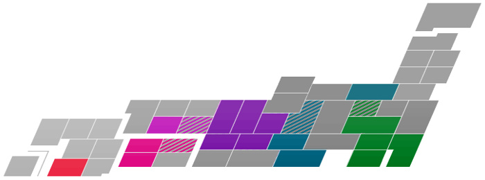

# I study Japanese!
*継続は力なり*

I started off with three beginner level Japanese courses offered by the language center at my uni. Once they were over I continued learning on my own.

## &gt; Main quest: learn the language
#####  
### Reading &amp; writing
‌  

(plotted using [this script](https://github.com/IllDepence/kanjiplot))  

Timeline |<!-- this makes the table work -->
:-------:|:-
13/03/27 | started taking three beginner level courses offered by the language center at my university
13/04/14 | started posting on [Lang 8](http://lang-8.com/588644/)
13/05/21 | started learning kanji with [Anki](http://ankisrs.net/)
13/06/18 | [100 kanji](/a/e61bc488)
13/07/10 | finished beginner level courses ([1.0, 1.0, 1.3](https://en.wikipedia.org/wiki/Grading_systems_by_country#Germany))
13/09/03 | [200 kanji](/a/6a66c49c)
13/09/19 | 500 words vocabulary
13/10/03 | [300 kanji](/a/51c3029e)
13/10/05 | started my [grammar rush](http://moc.sirtetris.com/grammar_rush/)
13/11/09 | [400 kanji](/a/82d546f5)
13/11/16 | 1000 words vocabulary
13/11/28 | finished the [grammar rush](http://moc.sirtetris.com/grammar_rush/)
13/12/01 | started a [re rush](http://moc.sirtetris.com/re_rush/)
13/12/10 | [500 kanji](/a/7b41827f) and 100 entries on [Lang-8](http://lang-8.com/)
13/12/30 | finished the [re rush](http://moc.sirtetris.com/re_rush/)
14/01/01 | started my [imabi stroll](http://moc.sirtetris.com/imabi_stroll/)
14/01/11 | [600 kanji](/a/3d745068)
14/02/12 | [700 kanji](/a/cdbe6ee9)
14/02/23 | finished the [imabi stroll](http://moc.sirtetris.com/imabi_stroll/)
14/03/10 | 2000 words vocabulary
14/03/18 | [800 kanji](/a/26ea4c37)
14/05/07 | [900 kanji](/a/53833ada)
14/06/28 | [1000 kanji](/a/62f53ec0)
14/08/08 | [1100 kanji](/a/412c3df8)
14/08/23 | 3000 words vocabulary
14/09/11 | [1200 kanji](/a/49fc37e4)
14/10/15 | [1300 kanji](/a/dd9836fb)
14/10/27 | started weekly tandem language learning sessions with Japanese exchange students
14/11/20 | [1400 kanji](/a/9b8e3e23)
14/12/23 | [1500 kanji](/a/52333c06)
14/12/31 | 4000 words vocabulary
15/01/27 | [1600 kanji](/a/3bb14cdc)
15/03/13 | [1700 kanji](/a/d5605b67)
15/04/18 | [1800 kanji](/a/bd733663), ended focussed pursuit of learning new kanji
15/07/15 | 5000 words vocabulary
15/08/11 | [1900 kanji](/a/ceb039a3)
15/09/24 | start of 2 classes at 松山大学 and 2 at 愛媛大学
16/04/11 | start of 1 class at 松山大学 and 3 at 愛媛大学
16/07/03 | took the JLPT N2 (result: 140/180)
16/09/15 | started [transcribing videos](http://moc.sirtetris.com/字幕挑戦投稿/)
16/10/06 | may or may not have started translating for a scanlation group
16/12/12 | [2000 kanji](/a/1f099c17)
18/05/01 | 6000 words vocabulary
18/07/01 | took the JLPT N1 (result: 111/180)
19/06/16 | took the 漢検５級 and ４級 (results: 165/200 and 146/200)
19/09/28 | [2100 kanji](/a/70125fa1)
21/06/04 | [100 recognition only kanji](/a/5797082c)
21/10/02 | [200 recognition only kanji](/a/579b082d)
22/01/22 | [300 recognition only kanji](/a/579f082e)
22/04/10 | [400 recognition only kanji](/a/57a3082f)

## &gt; Side quest: explore the country
#####  
### Progress
‌  

‌  

Timeline |<!-- this makes the table work -->
:-------:|:-
15/09/08 | half a day in 大阪府 — airports
15/09/09 | flight to 愛媛県 — new basis of operations
15/10/17 | bus tour to 高知県
15/11/28 | two day trip to 広島県
16/03/02 | train trip to 大阪府 along 香川県, 岡山県, 兵庫県
16/03/04 | train trip to 愛知県 along 京都府, 滋賀県, 岐阜県
16/03/06 | train trip to 東京都 along 静岡県, 神奈川県
16/03/10 | train trip to 京都府
16/08/08 | a night in a mountain hut on 富士山 (静岡県)
16/08/11 | a night in 藤沢 (神奈川県)
17/12/29 | train trip to 新潟県 along 埼玉県, 群馬県
18/01/10 | day trip to 埼玉県
18/04/21 | quick trip to 琵琶湖 (滋賀県)
18/04/30 | attended ニコニコ超会議 in 千葉県
19/06/21 | quick trip to 神戸 (兵庫県)
19/06/22 | quick trip to 奈良 (奈良県)
20/03/19 | four day trip to 鹿児島県

<!-- sep -->

# I tinker with tech!
*Mostly in terms of software though.*

[Linux systems](https://github.com/IllDepence/dotfiles), [tools](https://github.com/IllDepence/SVG_pitch), [games](https://github.com/IllDepence/GO-AWAY-I-M-EXPLODING), ... tinker with all the things! What you see above is one of my [Raspberry Pis](http://www.raspberrypi.org/). More software projects on the right hand side under <a href="#git_repos">Git repos</a>.

<!-- sep -->

# I have a website!
*It's a clunky pile of statically generated HTML but I don't care. :)*

Started doing this in 2005. Content changes over time as do my interests.

<!-- split -->

## Git repos

* [SVG pitch](https://github.com/IllDepence/SVG_pitch)
* [Ubunchu!](https://sirtetris.gitlab.io/ubunchu-translation/)
    * [blog entry](/a/d932debd)
* [{御,誤}用組文字](https://github.com/IllDepence/goyoukumimoji)
* [kanjiplot](https://github.com/IllDepence/kanjiplot)
* [findvocab](https://github.com/IllDepence/findvocab)
* [anihilist](https://github.com/IllDepence/anihilist)
* [calyx](https://github.com/IllDepence/calyx)
* [MALandBots](https://github.com/IllDepence/MALandBots)
* [userscripts](https://github.com/IllDepence/userscripts)
* [sirtetris.com](https://github.com/IllDepence/sirtetris.com)

<!-- sep -->

## MISC
* [Wikipedia](https://meta.wikimedia.org/wiki/User:IllDepence)
* [DB hidden buttons](/a/6a17efc0)
* [Giant pokemon](http://giantpokemon.tumblr.com/)
* [1.88 € time-lapse](assets/img/projects/ir_remote.png)
    * [blog entry](/a/d9000c79)
* [Link pixel cookies](assets/img/projects/lpc.jpg)
