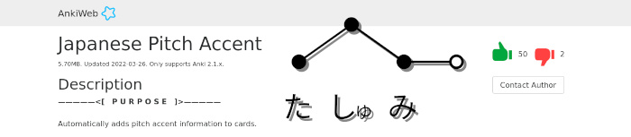
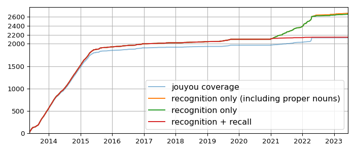
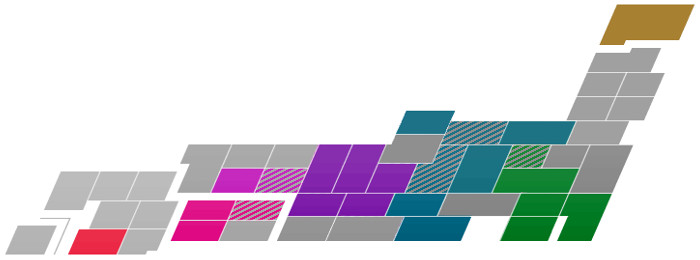
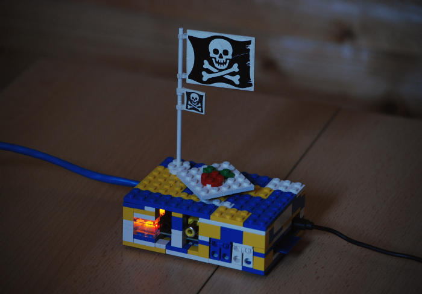

# Japanese Pitch Accent (Anki add-on)
*フラットです*

I wanted my Anki cards to display the pitch accent of words, so I wrote a plugin that automatically adds that information. Some noteworthy points:

* I kind of don’t like the types of pitch annotations that draw lines within the kana rendition of a word, like た&#124;しゅ&#124;み, or that only indicate the downstep. For my add-on I chose a style like the [大辞林](https://www.sanseido-publ.co.jp/publ/dicts/daijirin_ac.html) dictionary and [Dogen](https://www.youtube.com/watch?v=G0ULPlBeKzg) use. Circles connected by lines where (1) each circle shows the pitch of one mora (i.e. if two characters make up a 拗音, they are grouped together) and (2) the pitch of the mora following the word is also shown.
* The pitch illustrations are added to cards as SVG, making them customizable via CSS, more lightweight than pixel graphics, and part of the Anki cards themselves rather than embedded media.
* The pitch information is taken from [Wadoku](https://www.wadoku.de/), who permissively share their dictionary data.
* Looking for a suitable data source was a great way to learn about different pitch accent annotation schemes ([see notes in my Wadoku parsing script](https://github.com/IllDepence/anki_add_pitch/blob/master/wadoku_parse.py)).

If you have some use for it: [here’s the plugin](https://ankiweb.net/shared/info/148002038) and [here’s the code](https://github.com/IllDepence/anki_add_pitch_plugin). In case you have a use for SVG pitch accent illustrations outside of Anki or just want to play around a bit [here’s an online version](https://illdepence.github.io/SVG_pitch/).

<!-- sep -->

# A local Japan meetup
*恩返しでも自分勝手でもある*

While doing my master’s in Freiburg I regularly joined the local Japan meetup, which was loosely organized by a few grad students. Moving to Karlsruhe for my PhD I found no equivalent, so I started one myself. I knew from the Freiburg meetup that you need someone to proactively set a date, advertise the thing, reserve a table, etc., otherwise things die down quickly. Given that I would be in Karlsruhe for around four years anyway, my situation seemed like a good fit.

So, in case you’re from somewhere around the area: [here’s the link](https://japanstammtisch.github.io/).

<!-- sep -->

# Studying Japanese
*継続は力なり*

I started off with three beginner level Japanese courses offered by the language center at my uni. Once they were over I continued learning on my own.

## &gt; Main quest: learn the language
#####  
### Reading progress
#####  

<table id="bookshelf">
<tr><td><ol>
<!--<li>教室内カースト</li>-->
<!--<li>文系と理系はなぜ分かれたのか</li>-->
<li>印刷に恋して</li>
<li>辞書編集、三十七年</li>
<li>活字が消えた日</li>
<li>活版印刷三日月堂 小さな折り紙</li>
<li>都道府県の持ちかた</li>
<li>漢字の成り立ち</li>
<li>知るほどに深くなる漢字のツボ</li>
<li>「その他の外国文学」の翻訳者</li>
</ol></td>
<th>Plan to read</th>

<td><ol>
<li>日本語雑記帳</li>
<li>ユニコード戦記</li>
<li>「舞姫」の主人公をバンカラとアフリカ人がボコボコにする最高の小説の世界が明治に存在したので20万字くらいかけて紹介する本</li>
<li>鳩居堂の日本のしきたり 豆知識</li>
<li>活版印刷三日月堂 空色の冊子</li>
</ol></td>
<th>Reading / Paused</th>

<td><ol>
<li>九州は横浜のどこですか？上巻</li>
<li>九州は横浜のどこですか？下巻</li>
<li>猫の事務所</li>
<li>世界の文字</li>
<li>字幕屋に「、」はない</li>
<li>活版印刷三日月堂 星たちの栞</li>
<li>日本語びいき</li>
<li>同時通訳はやめられない</li>
<li>活版印刷三日月堂 海からの手紙</li>
<li>活版印刷三日月堂 庭のアルバム </li>
<li>羅生門</li>
<li>活版印刷三日月堂 雲の日記帳</li>
<li>コンビニ人間</li>
<li>ようこそ保健室へ</li>
<li>絶滅危惧動作図鑑</li>
<li>新解さんの謎</li>
<li>日本語の「大疑問」</li>
<li>僕とツンデレとハイデガー</li>
<li>漢字はコワくない </li>
</ol></td>
<th>Read</th></tr>

</table>

#####  
### Kanji progress

#####  
### General timeline
‌  

Timeline |<!-- this makes the table work -->
:-------:|:-
13/03/27 | started taking three beginner level courses offered by the language center at my university
13/04/14 | started posting on [Lang 8](http://lang-8.com/588644/)
13/05/21 | started learning kanji with [Anki](http://ankisrs.net/)
13/06/18 | [100 kanji](/a/e61bc488)
13/07/10 | finished beginner level courses ([1.0, 1.0, 1.3](https://en.wikipedia.org/wiki/Grading_systems_by_country#Germany))
13/09/03 | [200 kanji](/a/6a66c49c)
13/09/19 | 500 words vocabulary
13/10/03 | [300 kanji](/a/51c3029e)
13/10/05 | started my [grammar rush](http://moc.sirtetris.com/grammar_rush/)
13/11/09 | [400 kanji](/a/82d546f5)
13/11/16 | 1000 words vocabulary
13/11/28 | finished the [grammar rush](http://moc.sirtetris.com/grammar_rush/)
13/12/01 | started a [re rush](http://moc.sirtetris.com/re_rush/)
13/12/10 | [500 kanji](/a/7b41827f) and 100 entries on [Lang-8](http://lang-8.com/)
13/12/30 | finished the [re rush](http://moc.sirtetris.com/re_rush/)
14/01/01 | started my [imabi stroll](http://moc.sirtetris.com/imabi_stroll/)
14/01/11 | [600 kanji](/a/3d745068)
14/02/12 | [700 kanji](/a/cdbe6ee9)
14/02/23 | finished the [imabi stroll](http://moc.sirtetris.com/imabi_stroll/)
14/03/10 | 2000 words vocabulary
14/03/18 | [800 kanji](/a/26ea4c37)
14/05/07 | [900 kanji](/a/53833ada)
14/06/28 | [1000 kanji](/a/62f53ec0)
14/08/08 | [1100 kanji](/a/412c3df8)
14/08/23 | 3000 words vocabulary
14/09/11 | [1200 kanji](/a/49fc37e4)
14/10/15 | [1300 kanji](/a/dd9836fb)
14/10/27 | started weekly tandem language learning sessions with Japanese exchange students
14/11/20 | [1400 kanji](/a/9b8e3e23)
14/12/23 | [1500 kanji](/a/52333c06)
14/12/31 | 4000 words vocabulary
15/01/27 | [1600 kanji](/a/3bb14cdc)
15/03/13 | [1700 kanji](/a/d5605b67)
15/04/18 | [1800 kanji](/a/bd733663), ended focussed pursuit of learning new kanji
15/07/15 | 5000 words vocabulary
15/08/11 | [1900 kanji](/a/ceb039a3)
15/09/24 | start of 2 classes at 松山大学 and 2 at 愛媛大学
16/04/11 | start of 1 class at 松山大学 and 3 at 愛媛大学
16/07/03 | took the JLPT N2 (result: 140/180)
16/09/15 | started [transcribing videos](http://moc.sirtetris.com/字幕挑戦投稿/)
16/10/06 | may or may not have started translating for a scanlation group
16/12/12 | [2000 kanji](/a/1f099c17)
18/05/01 | 6000 words vocabulary
18/07/01 | took the JLPT N1 (result: 111/180)
19/06/16 | took the 漢検５級 and ４級 (results: 165/200 and 146/200)
19/09/28 | [2100 kanji](/a/70125fa1)
21/06/04 | [100 recognition only kanji](/a/5797082c)
21/10/02 | [200 recognition only kanji](/a/579b082d)
22/01/22 | [300 recognition only kanji](/a/579f082e)
22/04/10 | [400 recognition only kanji](/a/57a3082f)
22/04/17 | [covered all 常用漢字](/a/b9180b80) with recognition only & recognition+recall decks
22/05/03 | started dedicated learning of people and place names using [this deck](https://ankiweb.net/shared/info/3885156604)

## &gt; Side quest: explore the country
#####  
### Progress
‌  

‌  

Timeline |<!-- this makes the table work -->
:-------:|:-
15/09/08 | half a day in 大阪府 — airports
15/09/09 | flight to 愛媛県 — new basis of operations
15/10/17 | bus tour to 高知県
15/11/28 | two day trip to 広島県
16/03/02 | train trip to 大阪府 along 香川県, 岡山県, 兵庫県
16/03/04 | train trip to 愛知県 along 京都府, 滋賀県, 岐阜県
16/03/06 | train trip to 東京都 along 静岡県, 神奈川県
16/03/10 | train trip to 京都府
16/08/08 | a night in a mountain hut on 富士山 (静岡県)
16/08/11 | a night in 藤沢 (神奈川県)
17/12/29 | train trip to 新潟県 along 埼玉県, 群馬県
18/01/10 | day trip to 埼玉県
18/04/21 | quick trip to 琵琶湖 (滋賀県)
18/04/30 | attended ニコニコ超会議 in 千葉県
19/06/21 | quick trip to 神戸 (兵庫県)
19/06/22 | quick trip to 奈良 (奈良県)
20/03/19 | four day trip to 鹿児島県
22/10/08 | three day trip to 金沢 (石川県) along 富山県
22/10/17 | two day trip to 軽井沢 (長野県)
23/03/29 | entered Japan in 札幌 (北海道)

<!-- sep -->

# Tinkering with tech
*Mostly in terms of software though.*

[Linux systems](https://github.com/IllDepence/dotfiles), [tools](https://github.com/IllDepence/SVG_pitch), [games](https://github.com/IllDepence/GO-AWAY-I-M-EXPLODING), ... tinker with all the things! What you see above is one of my [Raspberry Pis](http://www.raspberrypi.org/). More software projects on the right hand side under <a href="#git_repos">Git repos</a>.

<!-- sep -->

# A website
*It's a clunky pile of statically generated HTML but I don't care. :)*

Started doing this in 2005. Content changes over time as do my interests. Overall the website is as much a form of a creative outlet as it is a tool for self reflection (which ... somehow has to be public for all the world to see ... I don’t know, humans are weird and that’s okay).

<!-- split -->

## Git repos

* [SVG pitch](https://github.com/IllDepence/SVG_pitch)
* [Ubunchu!](https://sirtetris.gitlab.io/ubunchu-translation/)
    * [blog entry](/a/d932debd)
* [{御,誤}用組文字](https://github.com/IllDepence/goyoukumimoji)
* [kanjiplot](https://github.com/IllDepence/kanjiplot)
* [findvocab](https://github.com/IllDepence/findvocab)
* [anihilist](https://github.com/IllDepence/anihilist)
* [calyx](https://github.com/IllDepence/calyx)
* [MALandBots](https://github.com/IllDepence/MALandBots)
* [userscripts](https://github.com/IllDepence/userscripts)
* [sirtetris.com](https://github.com/IllDepence/sirtetris.com_2021_jekyll)

<!-- sep -->

## MISC
* [Wikipedia](https://meta.wikimedia.org/wiki/User:IllDepence)
* [DB hidden buttons](/a/6a17efc0)
* [Giant pokemon](http://giantpokemon.tumblr.com/)
* [1.88 € time-lapse](assets/img/projects/ir_remote.png)
    * [blog entry](/a/d9000c79)
* [Link pixel cookies](assets/img/projects/lpc.jpg)
